<p align="center">
    <br>
    
    <br>
<p>
<p align="center">
 <a href="https://uniapp.dcloud.net.cn/"></a>
<a href="https://cn.vuejs.org/v2/guide/"></a>
<a href="https://echarts.apache.org/zh/index.html"></a>
<a href="https://dev.qweather.com/docs/api/"></a>
<a href="https://github.com/YoungErm/WeatherVisualization/blob/main/LICENSE"></a>
<a></a>
<a></a>
</p>

- [Overview](#overview)
- [Architecture](#architecture)
- [Quick tour](#quick-tour)
- [Online demos](#online-demos)
- [References](#references)
- [Appendix](#appendix)
  * [A.1 Directory structure](#a1-directory-structure)
  * [A.2 Index.vue](#a2-indexvue)
    + [template](#template)
    + [script](#script)
    + [style](#style)
  * [A.3 Example: Weather forecast for the next 24 hours](#a3-weather-forecast-for-the-next-24-hours)
  * [A.4 Others instructions](#a4-others-instructions)
    + [Page Lifecycle](#page-lifecycle)


##  Overview

**天气可视化** 是一个基于`uni-app`构建的微信小程序。该微信小程序为用户提供了实时的天气查询，生活指数和空气质量的可视化，并且对未来2小时内降雨进行了预测。

文档和项目中均有很多不完善和不正确的地方，请读者批评指正。

## Architecture

小程序 **天气可视化** 的整体架构如下：

> 1. 获取用户的地理位置（或者由用户指定要查询的位置）
> 2. 通过`和风天气`API获取对应位置的天气数据（气温、降雨、空气质量、生活指数…）
> 3. 对获取到的数据进行处理
> 4. 将处理好的数据通过`Echarts`展现出来，完成**可视化**
> 5. 整个流程基于`uni-app`框架开发
> 6. 测试、预览和体验
> 7. 最后发布上线

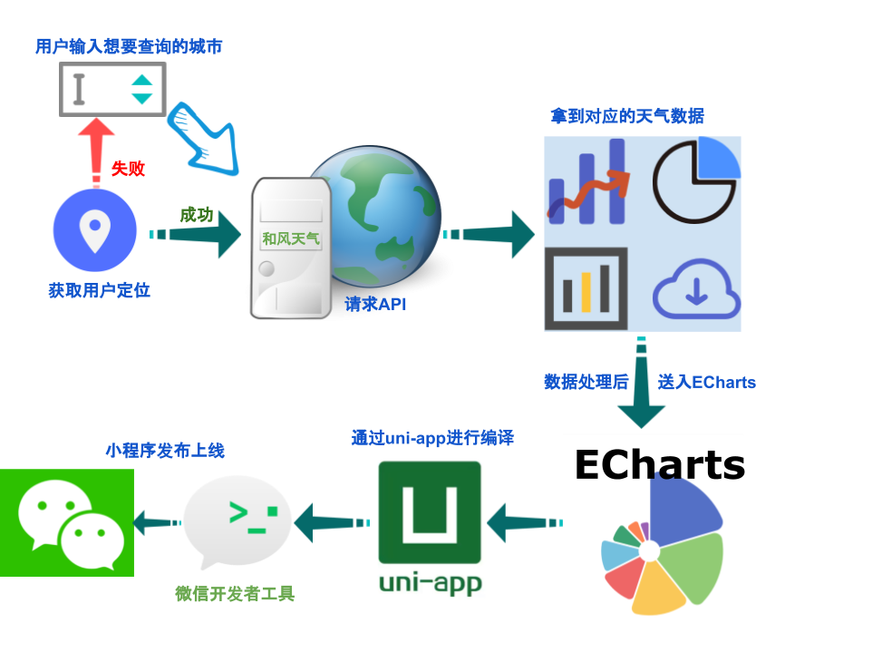

## Quick tour

为了快速使用本仓库的代码，推荐[HBuilderX](https://www.dcloud.io/hbuilderx.html):

```bash
git clone https://github.com/YoungErm/WeatherVisualization
cd WeatherVisualization  #  通过HBuilder打开

# HBuilder可以快速下载框架下所需插件、减少学习成本：
#     1. scss/sass:https://ext.dcloud.net.cn/plugin?id=2046
#     2. echarts:https://ext.dcloud.net.cn/plugin?id=4899
```

点击运行—运行到小程序模拟器—[微信开发者工具](https://developers.weixin.qq.com/miniprogram/dev/devtools/download.html)

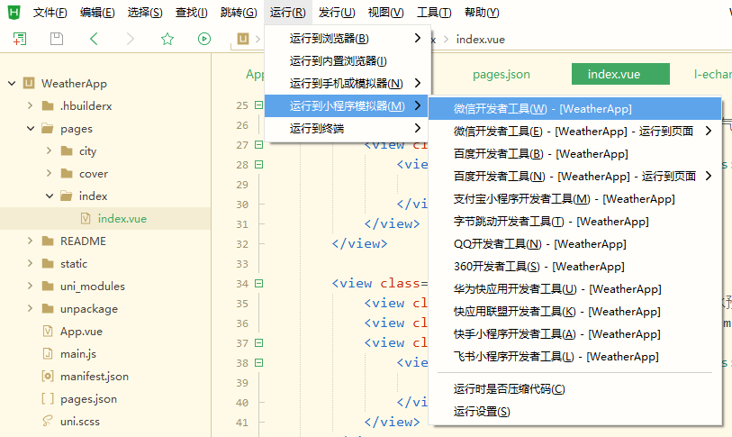

## Online demos

效果展示：

> 封面—>首页（24小时天气预报—2小时降水预报—生活指数—空气指数）—>选择城市

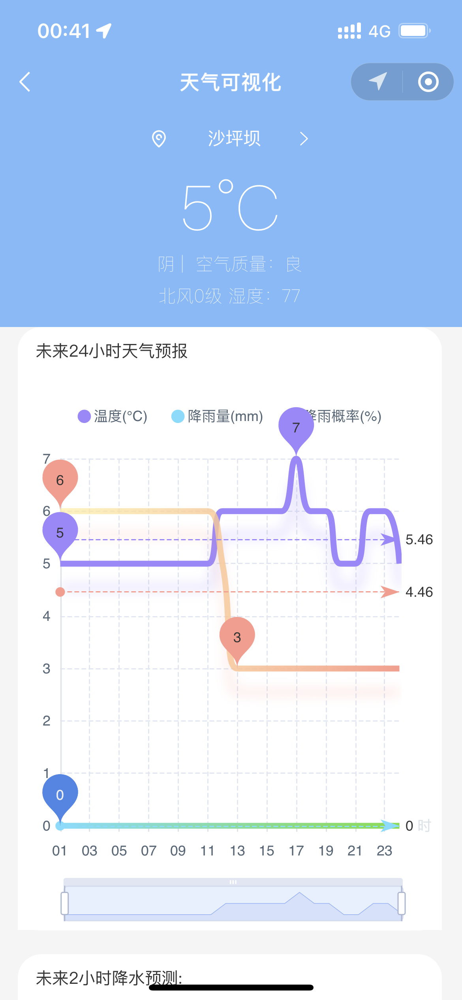

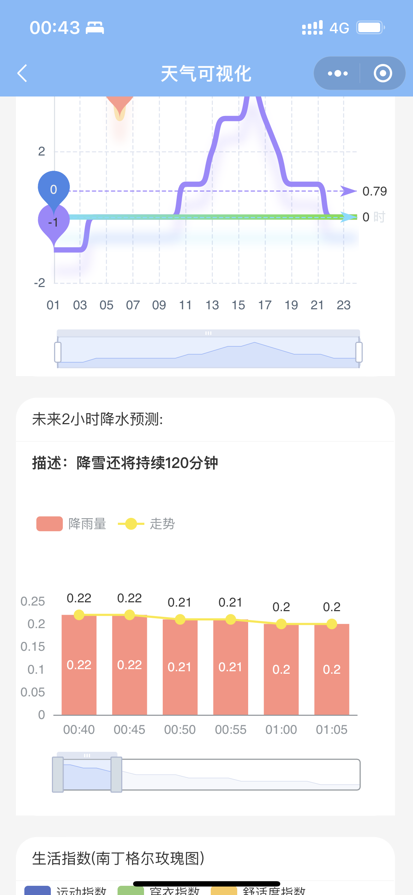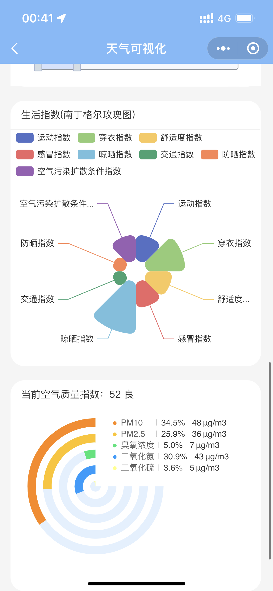

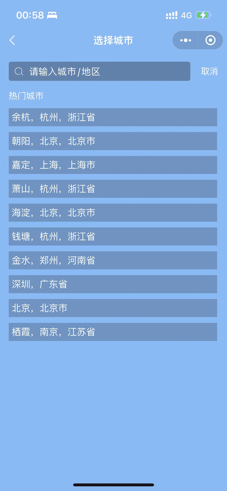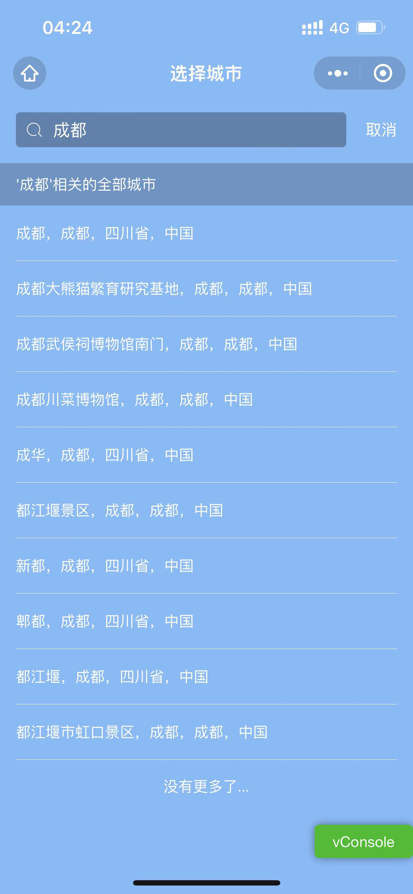

**天气可视化** 现已上线微信客户端，用户可扫描下面二维码进行体验： 


## References

- [uni-app官网文档](https://uniapp.dcloud.net.cn/)
- [LimeUi - 多端uniapp组件库 (Echarts块)](https://limeui.qcoon.cn/#/echart)
- [Vue.js官网文档](https://cn.vuejs.org/v2/guide/)
- [单文件组件规范 | Vue Loader (vuejs.org)](https://vue-loader.vuejs.org/zh/spec.html#简介)
- [微信小程序官网文档 ](https://developers.weixin.qq.com/miniprogram/dev/framework/)
- [ECharts官网文档](https://echarts.apache.org/zh/option.html#title)
- [天气APP参考项目](https://github.com/liuyao64/weatherForecast)
- [和风API开发文档](https://dev.qweather.com/docs/api/)
- [封面Echarts图](https://www.makeapie.com/editor.html?c=xB1-wDluNX)
- [24小时天气预报图](https://www.makeapie.com/editor.html?c=xRmuUp8m9b)
- [未来2小时降水预测图](https://www.makeapie.com/editor.html?c=xSJJXiE1Wx)
- [生活指数（南丁格尔玫瑰图）](https://limeui.qcoon.cn/#/echart-example)
- [当前空气质量指数图](https://www.makeapie.com/editor.html?c=xrD67xXLT9)
- [小程序图标](https://www.iconfont.cn/collections/detail?spm=a313x.7781069.1998910419.dc64b3430&cid=25190)

## Appendix

### A.1 Directory structure 

首先简单介绍一下uni-app模板的目录结构：

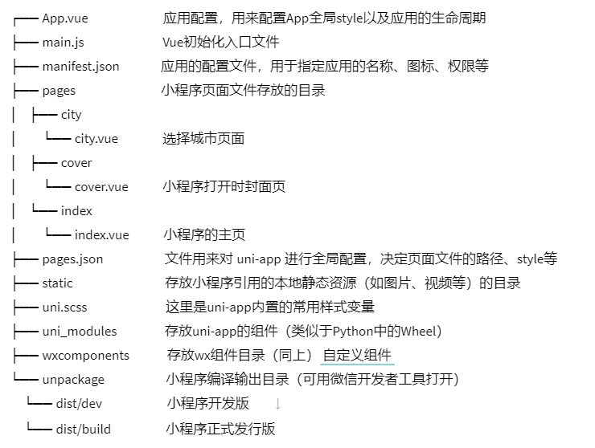
    

首先，我们需要在`mainifest.json`中配置我们[小程序的ID](https://developers.weixin.qq.com/miniprogram/dev/framework/quickstart/getstart.html#%E7%94%B3%E8%AF%B7%E5%B8%90%E5%8F%B7)，本次只针对微信小程序进行开发，除了**AppID**之外还需要额外配置一下位置权限即可：

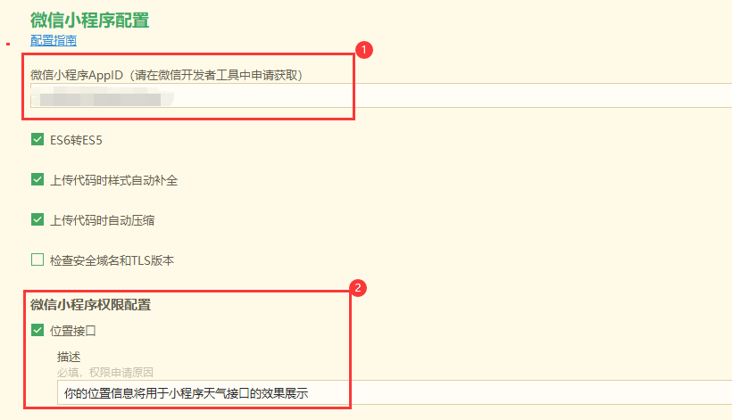

其次，我们要将我们的小程序的页面路径添加进`pages.json`文件中，由于使用`HBuilderX`IDE在创建页面文件时，IDE会自动帮我们添加进去。

到这里，准备工作就完成了。我们就在`pages/XXX/XXX.vue`就可以写我们的代码了。（其他的文件目录作为了解即可不需要立马完全弄明白，这里不做详细介绍）

### A.2 Index.vue

下面是`.vue`文件的样例：

```vue
<template>
  // 注意必须有一个view，且只能有一个根view。所有内容写在这个view下面。
  <view class="example">{{ msg }}</view>
</template>

<script>
export default {
  data () {
    return {
      msg: 'Hello world!'
    }
  }
}
</script>

<style>
.example {
  color: red;
}
</style>
```

#### template

- 每个 `.vue` 文件最多包含一个 `<template>` 块。
  - 这块内容专注于做视图UI的处理
- `<template>` 下有且仅有一个根 `<view>` 组件
  - 以前`html`中的`div`、`p`标签，现在都用`<view>`组件

#### script

- 每个 `.vue` 文件最多包含一个 `<script>` 块。

- 以往我们修改某个 DOM 元素的显示内容，我们给它设定`id`，然后通过js中的选择器`document.getElementById`来获取DOM元素，以此来修改DOM元素的属性或值

  - 现在是vue的绑定模式，给这个 DOM 元素绑定一个js变量，在`<script>`中修改js变量的值，DOM 会自动变化，页面会自动更新渲染。

    ```vue
    <view>  
         <text>{{textvalue}}</text>  这里通过{{}}绑定了textvalue组件的值
    </view> 
    ```

    我们只需要在`<script>`中修改textvalue的值，那么页面中就会对应修改:

    ```vue
        <script>  
            export default {  
                data() {  
                    return {  
                        textvalue:"123",   //初始值为123
                    };  
                },    
                methods: {  
                    changetextvalue() {  
                        this.textvalue="789" //我们在这里修改textvalue的值，当我们调用这个方法的时候，页面就会自动刷新为789  
                    }  
                }  
            }  
        </script>
    ```

#### style

- 一个 `.vue` 文件可以包含多个 `<style>` 标签。
- 可以简单理解为传统中的`.css`文件

### A.3 Weather forecast for the next 24 hours

下面我们以**未来24小时天气预报**为例，讲解一下整个项目的思路：

首先我们在根组件`<view>`中创建一个子组件，并且在`<style>`中创建我们的样式

```vue
<template>
	<view">		
        <view class="forecast-box">
			// 这里相当于一个容器，我们在容器中存放我们要展示的文字、图像等内容
        </view>
    </view>
</template>

<script>
    export default {
      data () {
        return {
            
        }
      }
    }
</script>

<style>
    .forecast-box {
		min-height: calc(100% + 1px);
		width: 690rpx;
		margin: 0 40rpx 40rpx 30rpx;
		border-radius: 40rpx;
		border-bottom-left-radius: 40rpx;
		border-bottom-right-radius: 40rpx;
		background-color: #FFFFFF;
		color: #333333;
		font-size: 28rpx;
		position: relative;
	}
</style>
```

这个作为我们的一个放未来24小时天气预报的‘容器’:

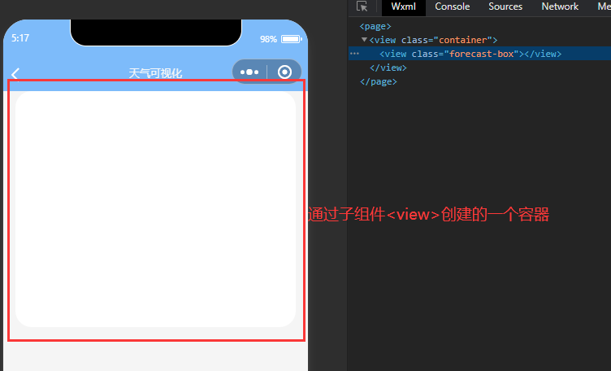

首先，我们在这个‘容器’中，再创建一个子组件`<view>`写上我们的标题**未来24小时天气预报**（配置一下样式）：

```vue
<template>
	<view">		
        <view class="forecast-box">
			// 这里相当于一个容器，我们在容器中存放我们要展示的文字、图像等内容
            <view class='forecast-box-title'>未来24小时天气预报</view>
        </view>
    </view>
</template>

<script>
    export default {
      data () {
        return {
            
        }
      }
    }
</script>

<style>
    .forecast-box {
		min-height: calc(100% + 1px);
		width: 690rpx;
		margin: 0 40rpx 40rpx 30rpx;
		border-radius: 40rpx;
		border-bottom-left-radius: 40rpx;
		border-bottom-right-radius: 40rpx;
		background-color: #FFFFFF;
		color: #333333;
		font-size: 28rpx;
		position: relative;
	}
    
    .forecast-box-title {
		width: 630rpx;
		padding: 0 30rpx;
		height: 80rpx;
		line-height: 80rpx;
		border-bottom: 1rpx solid #eee;
	}
</style>
```

这样我们就得到了我们的一个小标题：

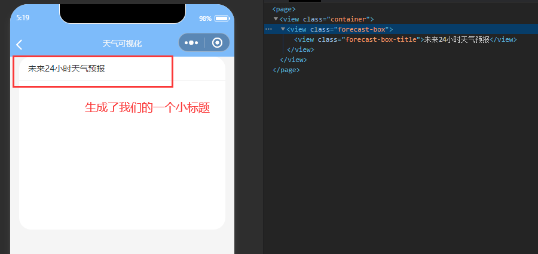

然后我们接着创建一个子组件`<view>`存放我们的24小时天气走势图：

- 这个子组件`<view>`中引入`Echarts`组件（我这里用的是大佬在移动端封装好的[Echarts组件](https://gitee.com/liangei/lime-echart)）
- 并且指定子组件注册引用信息`ref="chart1"`，这里相当于传统中，我们给DOM容器指定`id="chart1"`，方便下面使用`this.$ref.chart1`来获取`l-echart`实例
- 我们在`<script>`中通过`this.$refs.chart1.init`来获取实例，并且获取到数据过后，配置Echarts对应的`option`来生成我们想要的图表
  - 这里假设方法`get24hoursData()`可以获取到我们想要的数据，并且对数据进行了处理

```vue
<template>
	<view">		
        <view class="forecast-box">
			// 这里相当于一个容器，我们在容器中存放我们要展示的文字、图像等内容
            <view class='forecast-box-title'>未来24小时天气预报</view>
            <view style="height: 900rpx;border-radius: 40rpx;">
				<l-echart ref="chart1"></l-echart>
			</view>
        </view>
    </view>
</template>

<script>
    export default {
      data () {
        // 存放我们一些公用的变量，例如用户的位置信息等
        return {
        }
      },
      onShow(){
         //  页面每次出现在屏幕上会触发onShow()
         this.showCharts1();
      },
        
      methods:{
          // methods可以定义我们公用的方法
          async showCharts1() {
              	// 假设这里我们通过get24hoursData()方法拿回了数据
				const data24Hour = await this.get24hoursData();
                // 然后我们通过`refs`来找到chart1对应的组件
				this.$refs.chart1.init(config => {
					const {canvas} = config;
                    // 实例化chart对象
					const chart = echarts.init(canvas, null, config);
                    // 在这里利用上面的数据data24Hour来配置我们的Ehcarts的option
                    var option = {};
                    // 使配置项生效
                    chart.setOption(option);
                    // 最后通过返回我们的chart，将图像映射到<l-echart>组件中
					return chart; // 从而网页上显示我们的图表
                })
              
          }, //showCharts1() end
          
          
      } //methods end
        
    }
</script>

<style>
    .forecast-box {
		min-height: calc(100% + 1px);
		width: 690rpx;
		margin: 0 40rpx 40rpx 30rpx;
		border-radius: 40rpx;
		border-bottom-left-radius: 40rpx;
		border-bottom-right-radius: 40rpx;
		background-color: #FFFFFF;
		color: #333333;
		font-size: 28rpx;
		position: relative;
	}
    
    .forecast-box-title {
		width: 630rpx;
		padding: 0 30rpx;
		height: 80rpx;
		line-height: 80rpx;
		border-bottom: 1rpx solid #eee;
	}
</style>
```

到这里**未来24小时天气预报**就做好了，剩下的同理即可。

### A.4 Others instructions

#### Page Lifecycle

关于**页面的生命周期**，这里引用[微信开放文档 ](https://developers.weixin.qq.com/miniprogram/dev/framework/app-service/page-life-cycle.html)中的图进行说明：


